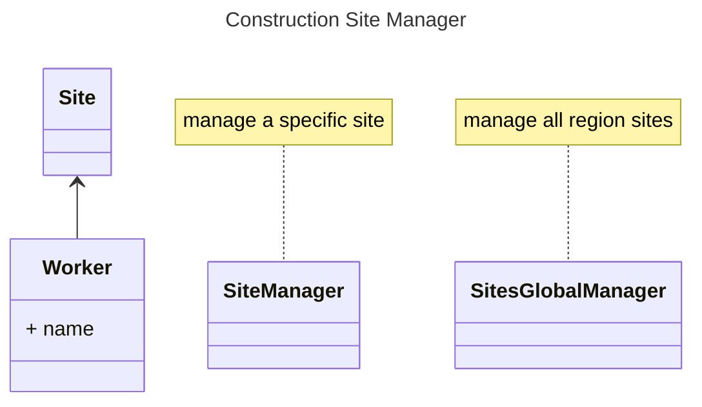

# Construction Site Manager - MMM Labs

<!-- [![Chrono GitHub Actions][gh-image]][gh-checks]
[![codecov.io][codecov-img]][codecov-link]

[gh-image]: https://github.com/chronotope/chrono/actions/workflows/test.yml/badge.svg?branch=main
[gh-checks]: https://github.com/chronotope/chrono/actions/workflows/test.yml?query=branch%3Amain
[codecov-img]: https://img.shields.io/codecov/c/github/chronotope/chrono?logo=codecov
[codecov-link]: https://codecov.io/gh/chronotope/chrono -->

## Model

## TODOs

- [x] Auth
  - [x] GitHub Auth
- [ ] Database
  - [ ] Diesel Model
- [ ] Roles
  - [ ] SiteManager
  - [ ] SitesGlobalManager
