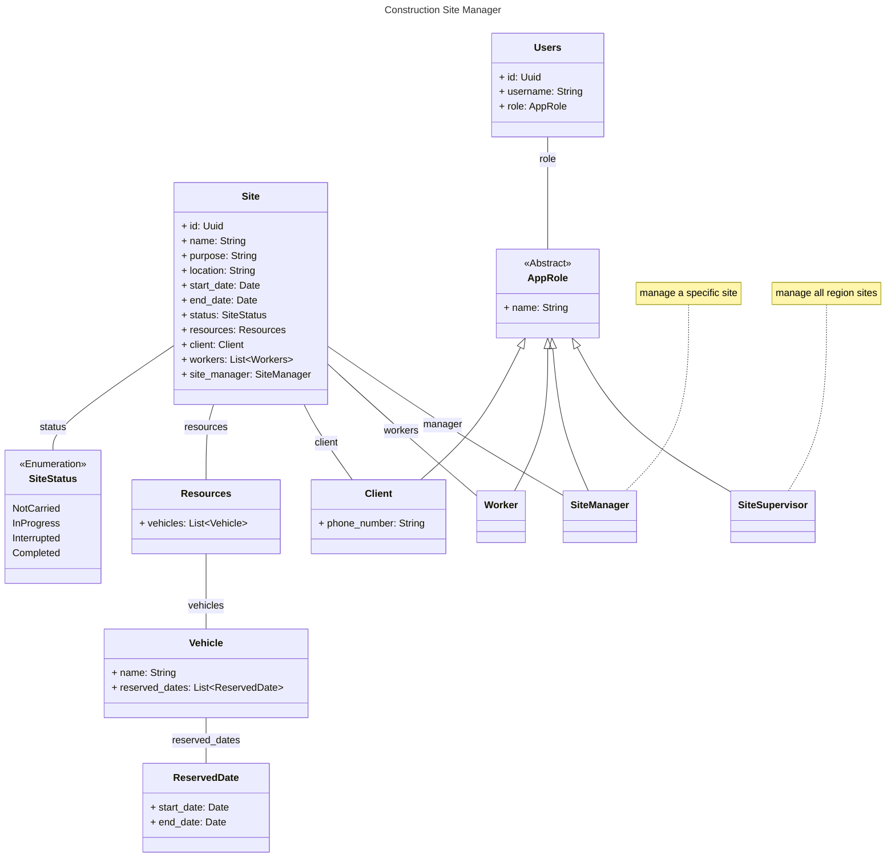

# Construction Site Manager - MMM Labs

[![ConstructionSIteManagerBack GitHub Actions][gh-image]][gh-checks]
[![codecov.io][codecov-img]][codecov-link]

[gh-image]: https://github.com/Wabtey/mmm_construction_site_manager_back/actions/workflows/rust.yml/badge.svg?branch=develop
[gh-checks]: https://github.com/Wabtey/mmm_construction_site_manager_back/actions/workflows/rust.yml?query=branch%3Adevelop
[codecov-img]: https://codecov.io/gh/Wabtey/mmm_construction_site_manager_back/branch/develop/graph/badge.svg?token=XNWVB2LW8A
[codecov-link]: https://codecov.io/gh/Wabtey/mmm_construction_site_manager_back

## Features

- stores all the DB and CRUD operations
- authentication mechanism to distinguish `SiteManager`s (chef·fe de chantier) of `SiteSupervisor`s (responsable des chantiers) of `Client`s.
- endpoints
  - get all uncompleted sites
  - get site info
  - edit site infos (status, ...)
  - feedback on site's anomalies (difficulty, break, accident, ...)
  - TODO: feat - site photos + description
  - TODO: feat - get all available `SiteManager`

## Endpoints under the `/api`

<details>
<summary>CRUD</summary>

| Operation           | URL                                      | Body                  | Return                                              |
| ------------------- | ---------------------------------------- | --------------------- | --------------------------------------------------- |
| **Sites**           |                                          |                       |                                                     |
| GET                 | `/sites`                                 | -                     | `Vec<Site>` all sites                               |
| POST                | `/sites`                                 | JSON `Site`           | 201 `Site` created site                             |
| PUT                 | `/sites/<site_id>`                       | JSON `Site`           | `Site` The updated site or 404                      |
| DELETE              | `/sites/<site_id>`                       | -                     | `Site` deleted site or 404                          |
| **Users**           |                                          |                       |                                                     |
| GET                 | `/users`                                 | -                     | `Vec<String>` usernames                             |
| GET                 | `/users/<search_username>`               | -                     | `User` searched user (rust type) or 404             |
| **Clients**         |                                          |                       |                                                     |
| GET                 | `/clients`                               | -                     | `Vec<Client>` all clients                           |
| GET                 | `/clients/<client_id>`                   | -                     | `Client` searched client or 404                     |
| POST                | `/clients`                               | JSON `Client`         | 201 `Client` created client                         |
| PUT                 | `/clients/<client_id>`                   | JSON `Client`         | `Client` The updated client or 404                  |
| DELETE              | `/clients/<client_id>`                   | -                     | `Client` deleted client or 404                      |
| **SiteManagers**    |                                          |                       |                                                     |
| GET                 | `/site_managers`                         | -                     | `Vec<SiteManager>` all site_managers                |
| GET                 | `/site_managers/<site_manager_id>`       | -                     | `SiteManager` searched site_manager or 404          |
| POST                | `/site_managers`                         | JSON `SiteManager`    | 201 `SiteManager` created site_manager              |
| PUT                 | `/site_managers/<site_manager_id>`       | JSON `SiteManager`    | `SiteManager` The updated site_manager or 404       |
| DELETE              | `/site_managers/<site_manager_id>`       | -                     | `SiteManager` deleted site_manager or 404           |
| **SiteSupervisors** |                                          |                       |                                                     |
| GET                 | `/site_supervisors`                      | -                     | `Vec<SiteSupervisor>` all site_supervisors          |
| GET                 | `/site_supervisors/<site_supervisor_id>` | -                     | `SiteSupervisor` searched site_supervisor or 404    |
| POST                | `/site_supervisors`                      | JSON `SiteSupervisor` | 201 `SiteSupervisor` created site_supervisor        |
| PUT                 | `/site_supervisors/<site_supervisor_id>` | JSON `SiteSupervisor` | `SiteSupervisor` The updated site_supervisor or 404 |
| DELETE              | `/site_supervisors/<site_supervisor_id>` | -                     | `SiteSupervisor` deleted site_supervisor or 404     |
| **Workers**         |                                          |                       |                                                     |
| GET                 | `/workers`                               | -                     | `Vec<Worker>` all workers                           |
| GET                 | `/workers/<worker_id>`                   | -                     | `Worker` searched worker or 404                     |
| POST                | `/workers`                               | JSON `Worker`         | 201 `Worker` created worker                         |
| PUT                 | `/workers/<worker_id>`                   | JSON `Worker`         | `Worker` The updated worker or 404                  |
| DELETE              | `/workers/<worker_id>`                   | -                     | `Worker` deleted worker or 404                      |

</details>

<details>
<summary>Feature endpoints</summary>

| Operation | URL                                  | Body              | Return                                            |
| --------- | ------------------------------------ | ----------------- | ------------------------------------------------- |
| **Sites** |                                      |                   |                                                   |
| GET       | `/sites/uncompleted`                 | -                 | `Vec<Site>` sites that aren't completed yet       |
| PUT       | `/sites/<site_id>/status`            | JSON `SiteStatus` | `Site` site with its `SiteStatus` changed or 404  |
| **Users** |                                      |                   |                                                   |
| GET       | `/users/usernames`                   | -                 | `Vec<String>` usernames                           |
| GET       | `/users/usernames/<search_username>` | -                 | `User` searched user (rust type) or 404           |
| **Roles** |                                      |                   |                                                   |
| GET       | `/sites/<searched_site_id>/workers`  | -                 | `Vec<Worker>` workers of the searched site or 404 |

**TODO**: feedback on site's anomalies (difficulty, break, accident, ...)

</details>

## "Quick"start

- run the back
  - install rust (minimal profile, stable toolchain).
  `curl --proto '=https' --tlsv1.2 -sSf https://sh.rustup.rs | sh` from [rust-lang](https://www.rust-lang.org/tools/install)
  - setup `rocket`
    - edit the `Rocket.toml` file to include your github app secrets

    ```toml
    # you have to register a [github app here](https://github.com/settings/apps/new)
    client_id = "<the_client_id_of_your_newly_created_app>"
    client_secret = "<the_private_key_of_your_newly_created_app>"
    ```

- `cargo run`
- run the [Front](https://github.com/Wabtey/mmm_construction_site_manager) <!-- TODO: front tutorial -->

## Model


```mermaid
---
title: Construction Site Manager
---
classDiagram
    class Site {
        + id: Uuid
        + name: String
        + purpose: String
        + location: String
        + start_date: Date
        + end_date: Date
        + status: SiteStatus
        + resources: Resources
        + client: Client
        + workers: List~Workers~
        + site_manager: SiteManager
    }
    
    Site -- SiteStatus : status
    Site -- Resources : resources
    Site -- Client : client
    Site -- Worker : workers
    Site -- SiteManager : manager

    %% --------------------------- Site Attributes --------------------------- %%

    class SiteStatus {
        <<Enumeration>>
        NotCarried
        InProgress
        Interrupted
        Completed
    }

    class Resources {
        + vehicles: List~Vehicle~
    }

    Resources -- Vehicle : vehicles

    class Vehicle {
        + name: String
        + reserved_dates: List~ReservedDate~
    }

    class ReservedDate {
        + start_date: Date
        + end_date: Date
    }
    
    Vehicle -- ReservedDate : reserved_dates

    %% -------------------------------- Roles -------------------------------- %%

    class AppRole {
        <<Abstract>>
        + name: String
    }

    class Users {
        + id: Uuid
        + username: String
        + role: AppRole
    }
    
    Users -- AppRole : role

    class Client {
        + phone_number: String
    }

    class Worker {
    }

    note for SiteManager "manage a specific site"
    class SiteManager {
    }

    note for SiteSupervisor "manage all region sites"
    class SiteSupervisor {
    }

    AppRole <|-- Client
    AppRole <|-- Worker
    AppRole <|-- SiteManager
    AppRole <|-- SiteSupervisor
```

## TODOs

- [x] Auth
  - [x] GitHub Auth
- [x] ~~Database~~
  - [x] Diesel Model
  - [x] connect database to rocket diesel
  - [x] create and read
- [ ] Roles
  - [ ] SiteManager
  - [ ] SiteSupervisor

<!-- ## Debug

> [!NOTE]
> Within `sudo mysql -u root -p` / `sudo mariadb -u root -p`.
> You can check all your tables with `SHOW TABLES FROM sitemanagerdb;`. -->
